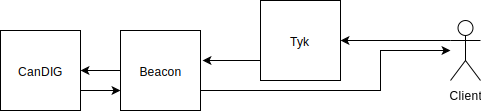

# Beacon API

Analysis and shortcomings to adoption

---

## Initial Plan

- A simple wrapper around candig server.
--

- Just map existing beacon queries to our api calls.

---

## Challenges to Initial Plan
--

- Lack of variant data seeded into development database

  Variant data was added to beacon to then be added to CanDIG, but
  vanilla CanDIG remains without seeded variant data.
--

- Federation wrapper can't be turned off and isn't documented

  An additional header (x-no-federation) was added to candig-server to
  turn the federation wrapping off and allow the generated client code
  to work. This PR has not been merged.
--

- OpenAPI spec assignes keys different naming convention

  The spec says that all JSON keys should be `snake_case` yet the
  server is sending them in `camelCase`.

  This has been updated in the openapi spec but the PR has not been
  merged.
---

## Challenges to Initial Plan Cont...
--

- Missing Assembly Id

  Assembly Id's are required to be present by the Beacon spec but
  CanDIG's spec claims they're optional. Furthermore, CanDIG doesn't
  even have the code necessary to send the Assembly Id to the client.

  No PR has been made to fix this.
--

- Stored data is read into memory from database

  This made adding data to CanDIG a huge challenge.
--

- /search and /count exposing internals that are undocumented

  These should at the very least be documented, yet because of how
  they leak implementation details, the documentation easily falls out
  of sync. Ideally, a proper abstraction would be built on top of
  this. Something like GraphQl would retain the full power and
  expressiveness while also giving a clean layer of abstraction.

---

## Conclusions

--

While a Beacon implementation on top of CanDIG is certainly possible.
The current state of `candig-server`'s API and documentation imposes
significant challenges to clients building on top of CanDIG.

--

Going forward into V2, adoption of basic schema testing and an OpenAPI
first approach to implementing the server layer will ensure the
documentation doesn't fall out of sync with the implementation as much
as it has in this instance.
